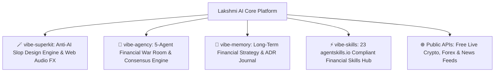

<div align="center">

# ⚡ Lakshmi AI — Power Suite v2.0
### Autonomous Multi-Agent Financial Intelligence, Predictive Analytics & Live War Room

[](https://github.com/shahrukh-hack)
[](https://react.dev/)
[](https://www.typescriptlang.org/)
[](https://apexcharts.com/)
[](https://tailwindcss.com/)
[](LICENSE)

<br />

> **Lakshmi AI is a next-generation Financial Intelligence & Autonomous Trading War Room. Upgraded and supercharged by fusing all 4 flagship repositories in The Vibe Coder's Power Suite (`vibe-superkit`, `vibe-agency`, `vibe-memory`, `vibe-skills`) with real-time public market data feeds from `public-apis`.**

</div>

---

## 🏛️ System Architecture: The Vibe Coder's Power Suite Fusion



---

## 🌟 Key Features & Capabilities

### 1. 🤖 5-Agent Financial War Room (`vibe-agency`)
* **Quant-X Algorithmic (`QX-900`):** Technical breakout analysis, 50/200 EMA crossovers, RSI/MACD divergence, and VWAP order flow.
* **AlphaVal Intrinsic (`AV-700`):** Fundamental DCF valuations, PEG ratio screening, and quarterly earnings momentum.
* **SentimentPulse (`SP-500`):** NLP parsing of live financial headlines, YouTube analyst transcripts, and social chatter.
* **RiskSentinel Guard (`RS-300`):** 95%/99% Value-at-Risk (VaR) limits, portfolio beta, and automated stop-loss protection.
* **MacroSphere Intelligence (`MS-800`):** Central bank rate trajectories, FX volatility, and sovereign liquidity cycles.
* **Live War Room Deliberation Feed:** Real-time inter-agent debate and consensus price target corridor (Bull / Base / Bear).

### 2. 🪄 Anti-AI-Slop FinTech Design Engine (`vibe-superkit`)
* **5 Bespoke Design Themes:** Tactile Obsidian Luxe, Kinetic Cyber, True OLED Black, Swiss Precision Light, and Editorial Warm.
* **Procedural Web Audio FX:** Synthesized tactile clicks, trade execution chimes, agent dispatch pulses, and alert dings.
* **Interactive ApexCharts:** Candlestick & Area charts with volume overlays, crosshair inspect, and timeframes (`1D`, `1W`, `1M`, `1Y`, `ALL`).
* **Global Command Palette (`⌘K / Ctrl+K`):** Fast search across equities, crypto, agents, memory theses, and platform navigation.

### 3. 🧠 Universal Strategy Memory Protocol (`vibe-memory`)
* **Active Investment Theses Log:** Persistent hypotheses, catalysts, invalidation criteria, and author agent tracking.
* **Architectural Decisions (ADR) Log:** Consensus quorum rules, slippage buffers, and zero-key fallback protocols.
* **Token Optimization Telemetry:** 97.4% token reduction via deterministic symbol AST pruning.

### 4. ⚡ 23 Standard Financial Skills Hub (`vibe-skills`)
* Interactive execution sandbox compliant with `agentskills.io`:
  - `rsi-macd-momentum-scanner`
  - `sentiment-nlp-parser`
  - `var-drawdown-stress-tester`
  - `dcf-valuation-model`
  - `anti-slop-portfolio-audit`

### 5. 🌐 Free Public APIs Integration (`public-apis/public-apis`)
* **Live Crypto Feeds:** Real-time prices for BTC, ETH, SOL, BNB, XRP via CoinGecko Free API.
* **Live FX Currency Rates:** USD, EUR, INR, GBP, AUD, JPY via Frankfurter Free API.
* **Live Market News Feed:** Real-time business and macroeconomic headlines with automated sentiment polarity tags.
* **Zero-API Key Fallback:** High-fidelity algorithmic simulation engine ensures uninterrupted charts and trade execution even offline.

### 6. 💼 Simulated Paper Trading Desk
* **$100,000 Starting Virtual Capital:** Real-time unrealized and realized P&L tracking, 0.05% slippage buffer, positions ledger, and audio execution feedback.

---

## 🚀 Quickstart

```bash
# Clone the repository
git clone https://github.com/shahrukh-hack/lakhsmiAI.git
cd lakhsmiAI

# Install dependencies
npm install

# Start development server
npm run dev

# Build for production
npm run build
```

---

## 🤝 Part of The Vibe Coder's Power Suite

1. 🪄 **[`vibe-superkit`](https://github.com/shahrukh-hack/vibe-superkit):** The Anti-AI Slop & High-Taste UI/UX Design Engine ([Live Demo](https://shahrukh-hack.github.io/vibe-superkit/))
2. 🧠 **[`vibe-memory`](https://github.com/shahrukh-hack/vibe-memory):** Universal Long-Term Memory & Codebase AST Intelligence ([Live Demo](https://shahrukh-hack.github.io/vibe-memory/))
3. ⚡ **[`vibe-skills`](https://github.com/shahrukh-hack/vibe-skills):** Mega-Library of 23 Standard Agent Skills (`agentskills.io`) ([GitHub Repo](https://github.com/shahrukh-hack/vibe-skills))
4. 🤖 **[`vibe-agency`](https://github.com/shahrukh-hack/vibe-agency):** Autonomous Multi-Agent Team Orchestrator with 200+ Agents ([Live Demo](https://shahrukh-hack.github.io/vibe-agency/))

---

## 👤 Author

Created with intention by **[Yogeshkumar Patel](https://github.com/shahrukh-hack)** • Adelaide, Australia 🇦🇺  
* **LinkedIn:** [https://www.linkedin.com/in/yogeshkumar-ai/](https://www.linkedin.com/in/yogeshkumar-ai/)  
* **GitHub:** [@shahrukh-hack](https://github.com/shahrukh-hack)

---

## 📄 License

MIT License © 2026 Yogeshkumar Patel
